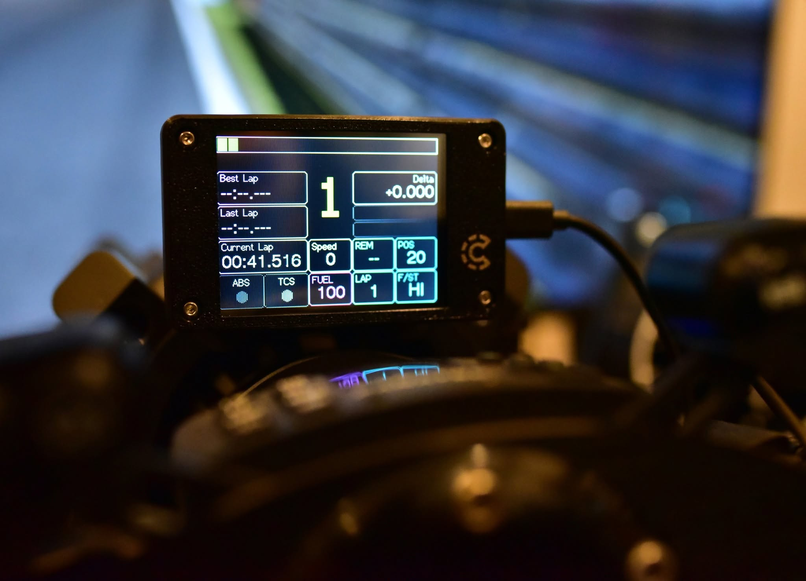
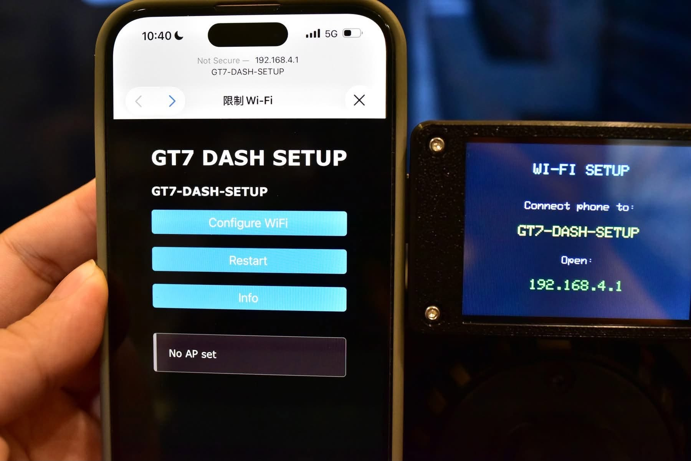

# ESP32 GT7 Dashboard

<p align="center">
  
</p>

A standalone **Gran Turismo 7 dashboard** running entirely on an ESP32.

**No SimHub. No PC.**

Simply connect your ESP32 to the same Wi-Fi network as your PS5 and enjoy real-time telemetry directly from Gran Turismo 7.

                ┌──────────────┐
                │     PS5      │
                │ Gran Turismo │
                │      7       │
                └──────┬───────┘
                       │ UDP
                Wi-Fi  │
                       ▼
              ┌─────────────────┐
              │ ESP32 Dashboard │
              │  Auto Detect    │
              └─────────────────┘
                       │
                2.8" TFT Display

---

## Features

- 🚗 Direct GT7 telemetry over Wi-Fi
- 📡 Automatic PS5 discovery
- 🔍 No IP address configuration required
- ⚡ No SimHub required
- 💻 No PC required after installation
- 📶 Built-in Wi-Fi configuration portal
- 🏁 Current, Last and Best lap times
- ⏱ Live Delta
- ⛽ Fuel consumption and remaining fuel estimation
- 🔄 Estimated laps remaining
- 🚦 RPM bar with configurable shift lights
- 🚨 ABS indicator
- 📊 Real-time telemetry display
- 🌙 Manual screen off
- 😴 Automatic sleep and automatic wake
- 💾 Wi-Fi credentials stored in flash memory
- 🎯 Designed specifically for Gran Turismo 7

---

## Supported Hardware

Currently supported:

- ESP32
- ESP32-2432S028 (2.8" ILI9341 Touch Display)

Additional ESP32 displays may be supported in future releases.

---

## Installation

### Web Installer (Recommended)

No development tools are required.

1. Connect your ESP32 to your computer using USB.
2. Open the Web Installer.
3. Click **Install**.
4. Wait for the installation to complete.
5. Disconnect the USB cable and power the device.

👉 **https://caa1211.github.io/esp32-gt7-dashboard/**

---

## Quick Start

### First Time Setup

When powered on for the first time (or after resetting Wi-Fi), the dashboard automatically starts Wi-Fi setup mode.

1. Connect your phone or computer to the Wi-Fi network:

```
GT7-DASH-SETUP
```

2. A configuration page should open automatically.

If it doesn't, open:

```
http://192.168.4.1
```

3. Select your home Wi-Fi network.
4. Enter the Wi-Fi password.
5. Click **Save**.
6. The dashboard will reboot automatically.
7. Launch **Gran Turismo 7**.

The dashboard will automatically discover your PS5 on the local network.

No IP address configuration is required.

<p align="center">
  
</p>

---

## Controls

### Touch Screen

**Tap**

- Turn the display on or off.

**Press and Hold (3sec)**

- Clear the saved Wi-Fi configuration.
- Reboot into Wi-Fi setup mode.

<p align="center">
  
</p>

---

## Sleep Mode

To reduce power consumption and extend display life:

- The display automatically enters sleep mode after several minutes without GT7 telemetry.
- It automatically wakes when GT7 telemetry is detected again.
- The display can also be turned off manually by tapping the screen.

---

## Screenshots

Coming soon.

---

## Roadmap

- [x] Direct GT7 telemetry
- [x] Automatic PS5 discovery
- [x] Wi-Fi configuration portal
- [x] Fuel prediction
- [x] Remaining laps estimation
- [x] Live Delta
- [x] ABS indicator
- [x] Automatic sleep mode
- [x] Manual screen off
- [ ] OTA firmware update
- [ ] Additional display support
- [ ] Custom themes
- [ ] Multiple dashboard layouts

---

## Building from Source

This project is built using:

- PlatformIO
- Arduino Framework
- ESP32

Clone the repository and build with PlatformIO.

```bash
git clone https://github.com/caa1211/esp32-gt7-dashboard.git
cd esp32-gt7-dashboard
pio run
```

---

## Contributing

Bug reports, feature requests and pull requests are welcome.

If you have ideas for new features or support for additional ESP32 displays, feel free to open an Issue.

---

## Open Source Credits

This project would not have been possible without the following open-source projects.

### SIMHUB ESP32 SUNTON Screen

https://github.com/1achy/https---github.com-1achy-SIMHUB-ESP32---SUNTON-screen

This project originally started as a fork of the SIMHUB ESP32 SUNTON Screen project.
It has since been substantially rewritten into a standalone GT7 dashboard with direct PS5 telemetry support and no longer depends on SimHub.

### gt7-udp

https://github.com/MacManley/gt7-udp

Used as a reference implementation for parsing Gran Turismo 7 UDP telemetry packets.

### WiFiManager

https://github.com/tzapu/WiFiManager

Provides the Wi-Fi configuration portal and captive portal functionality.

Many thanks to all of the authors and contributors who made these projects available to the community.

---

## License

This project is released under the MIT License.
