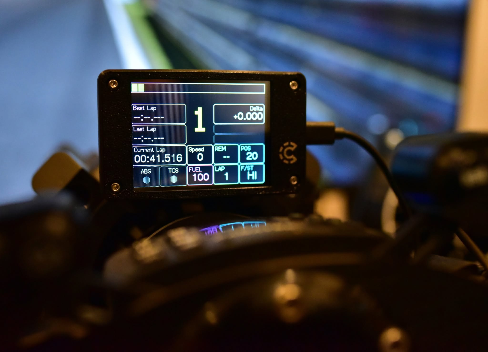
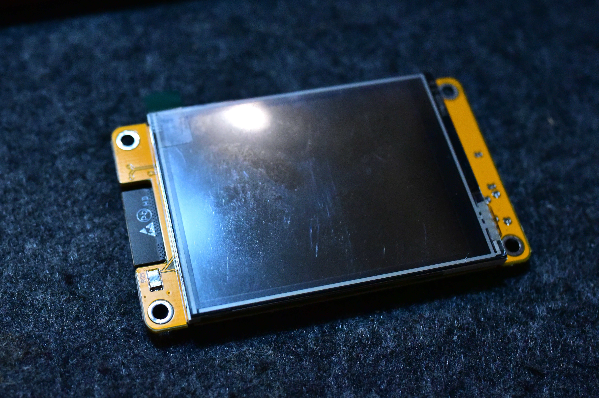
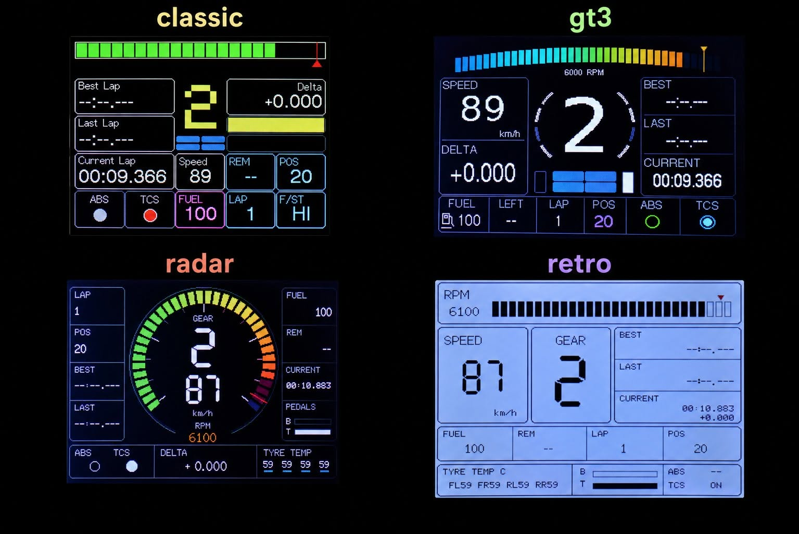

# ESP32 GT7 Dashboard ([Installer](https://caa1211.github.io/esp32-gt7-dashboard/?lang=en))

[English](README.md) | [繁體中文](README.zh-TW.md)

> **Theme development:** See the [theme guide](docs/THEME_DEVELOPMENT.md) and [implementation plan](docs/THEME_SWITCH_PLAN.md) for architecture, workflow and hardware acceptance checks.

An ESP32 dashboard with **direct GT7 Wi-Fi** and **SimHub USB** telemetry.
GT7 needs no PC or SimHub; PC games use the bundled SimHub Custom Protocol.

> **Source-tree feature:** Dual-source support requires a build of this source. The web installer continues to serve published releases. See [SimHub USB setup](SIMHUB_README.md).

<p align="center">
  
</p>

<p align="center">
  🎥 <a href="https://www.youtube.com/shorts/kHaoZkZnk8g"><strong>Watch the dashboard demo</strong></a>
</p>


Simply connect your ESP32 to the same Wi-Fi network as your PS5 and enjoy real-time telemetry directly from Gran Turismo 7.

                ┌──────────────┐
                │     PS5      │
                │ Gran Turismo │
                │      7       │
                └──────┬───────┘
                       │ UDP
                Wi-Fi  │
                       ▼
              ┌─────────────────┐
              │ ESP32 Dashboard │
              │  Auto Detect    │
              └─────────────────┘
                       │
                2.8" TFT Display

---

## Features

- 🚗 Direct GT7 telemetry over Wi-Fi
- 📡 Automatic PS5 discovery
- 🔍 No IP address configuration required
- 🔌 Optional SimHub USB for PC games, with [one formula for all themes](simhub/custom-protocol.txt)
- ⚡ No SimHub or PC required for direct GT7 after installation
- 📶 Built-in Wi-Fi configuration portal
- 🏁 Current, Last and Best lap times
- ⏱ Live Delta
- ⛽ Fuel consumption and remaining fuel estimation
- 🔋 Automatic EV detection with compact remaining-energy display
- 🔄 Estimated laps remaining
- 🚦 RPM bar with configurable shift lights
- 🚨 ABS indicator
- 📊 Real-time telemetry display
- 🌙 Manual screen off
- 😴 Automatic sleep and automatic wake
- 💾 Wi-Fi credentials stored in flash memory
- 🎯 Designed specifically for Gran Turismo 7

---

## Supported Hardware

Currently supported:

- ESP32-2432S028 with 2.8" ILI9341 touch display
- ESP32-2432S028 with 2.8" ST7789 touch display

<p align="center">
  
</p>

---

## Dashboard Themes

One firmware includes seven dashboard themes with the same live GT7 telemetry features:

- **GT3** (default) — centered gear, curved shift-light bar and a dark motorsport layout.
- **Classic** — the original engineering-style five-column dashboard.
- **Retro** — a warm paper-colored instrument panel with dark text and restrained accents.
- **Radar** — a circular tachometer-focused dark layout with side telemetry panels.
- **Mono** — a minimal black-and-white digital dashboard with a segmented shift-light bar.
- **Pocket** — a Game Boy-inspired pixel dashboard with a yellow-green display palette, block telemetry and compact driving-aid icons.
- **Endurance** — a glance-first race display with shift lights, a central gear tower, lap timing, tyre temperatures, pedal inputs and fuel strategy.

<p align="center">
  
</p>

While the display is active, tap it once, choose **SELECT THEME**, then select a theme. The selection is saved by enum value and restored after reboot. Switching the telemetry connection does not reset the selected theme or brightness.

---

## Installation

### Web Installer (Recommended)

No development tools are required.

1. Connect your ESP32 to your computer using USB.
2. Open the Web Installer.
3. Select the display controller fitted to the board: **ILI9341** or **ST7789**.
4. Click **Install**.
5. Wait for the installation to complete.
6. Disconnect the USB cable and power the device.

👉 **https://caa1211.github.io/esp32-gt7-dashboard/?lang=en**

The browser installer supports the classic ESP32 target configured by this repository.
Firmware maintainers can find the local build, binary staging, flash-offset, and publishing
procedure in [docs/RELEASING.md](docs/RELEASING.md).

---

## Quick Start

### First Time Setup

On a fresh device, complete Touch Setup first, then choose **DIRECT GT7** or **SIMHUB USB**. The selected connection is saved for later boots.

- **SimHub USB:** Wi-Fi stays off. Connect a data-capable USB cable to the PC and follow [SimHub setup](SIMHUB_README.md).
- **Direct GT7:** if no network is saved, the firmware opens Wi-Fi Setup automatically. Join **GT7-DASH-SETUP** on a phone, open **http://192.168.4.1**, choose the network shared with the PS5 and save.

The two connection paths are separate. Switch directly from the Waiting screen, or select **DIRECT GT7** / **SIMHUB USB** in **DEVICE SETTINGS**.

**RESET TO DEFAULT** clears Wi-Fi, connection, touch, theme and brightness settings, then returns to Touch Setup.

All seven themes work with either source. Missing values show `--` or disable the relevant indicator; game-specific GT7 calculations are not applied to SimHub data.

### Touch Orientation Setup

Touch Setup runs before connection selection on a fresh device or after Reset to Default:

1. Tap the target on the right so the firmware can detect orientation.
2. Tap the verification target on the left. The different position prevents an accidental double tap.
3. Select **SAVE**, or use **RETRY** if the detected direction is wrong.
4. Choose Direct GT7 or SimHub USB.

An incomplete setup times out without saving, and incoming GT7 telemetry closes the
setup immediately so it never holds the dashboard open. If an incorrect orientation is
saved, repeat the same procedure from the waiting screen to replace it.


---

## Controls

### Touch Screen

**Tap**

- Open Settings while the display is active.
- Wake the display when it is asleep; the first tap does not also open Settings.
- Select and save the Classic, GT3, Retro, Radar, Mono, Pocket, or Endurance dashboard theme.
- Open **DEVICE SETTINGS** to adjust brightness from 20% to 100% in 10% steps.
- Switch transport from the Waiting screen or directly under **DEVICE SETTINGS**, or clear all setup with **RESET TO DEFAULT**.

Brightness defaults to 80%, is saved after adjustment, and is restored after reboot or wake. Automatic sleep still turns the backlight fully off.

GT3 is used when no theme has been saved. Classic, GT3, Retro, Radar, Mono, Pocket and Endurance expose the same supported telemetry; only their presentation differs.

<p align="center">
  
</p>

---

## Sleep Mode

To reduce power consumption and extend display life:

- The display automatically enters sleep mode after several minutes without GT7 telemetry.
- It automatically wakes when GT7 telemetry is detected again.
- Tap the screen to wake it after automatic sleep.

---

## Roadmap

- [x] Direct GT7 telemetry
- [x] Automatic PS5 discovery
- [x] Wi-Fi configuration portal
- [x] Fuel prediction
- [x] Remaining laps estimation
- [x] Live Delta
- [x] ABS indicator
- [x] Automatic sleep mode
- [x] Manual screen off
- [ ] OTA firmware update
- [ ] Additional display support
- [ ] Custom themes
- [ ] Multiple dashboard layouts

---

## Building from Source

This project is built using:

- PlatformIO
- Arduino Framework
- ESP32

Clone the repository, then build both display-controller variants with PlatformIO:

```bash
git clone https://github.com/caa1211/esp32-gt7-dashboard.git
cd esp32-gt7-dashboard
pio run -e esp32 -e esp32-st7789
```

The application images are generated at:

- `.pio/build/esp32/firmware.bin` — ILI9341
- `.pio/build/esp32-st7789/firmware.bin` — ST7789

For a release build that also synchronizes the version, copies both images into
`installer/firmware/`, and validates both installer manifests, run:

First add a short change summary for the new version to
`installer/release-notes.json`. The publish command archives both display
variants for the installer and automatically keeps only the five most recent
versions.

```bash
npm run publish:firmware -- 1.2.5
```

Replace `1.2.5` with the version being released.

---

## Contributing

Bug reports, feature requests and pull requests are welcome.

If you have ideas for new features or support for additional ESP32 displays, feel free to open an Issue.

---

## Open Source Credits

This project would not have been possible without the following open-source projects.

### SIMHUB ESP32 SUNTON Screen

https://github.com/1achy/https---github.com-1achy-SIMHUB-ESP32---SUNTON-screen

This project originally started as a fork of the SIMHUB ESP32 SUNTON Screen project.
It has since been substantially rewritten with direct PS5 telemetry and shared dashboard themes. GT7 remains standalone; SimHub USB is an optional second telemetry source.

### gt7-udp

https://github.com/MacManley/gt7-udp

Used as a reference implementation for parsing Gran Turismo 7 UDP telemetry packets.

### WiFiManager

https://github.com/tzapu/WiFiManager

Provides the Wi-Fi configuration portal and captive portal functionality.

### 3D Printed Case for ESP32 CYD

A slim, minimalist enclosure designed specifically for the **ESP32-2432S028 (2.8" CYD)** is available on MakerWorld.

https://makerworld.com/zh/models/2171220-slim-minimal-case-for-esp32-cyd-2-4-2-8#profileId-2354976


Many thanks to all of the authors and contributors who made these projects available to the community.

---

## License

This project is released under the MIT License.

---

## Support the Project

If this dashboard has been useful to you, you can support its continued development:

☕ [**Support me on Ko-fi**](https://ko-fi.com/caa1211)
