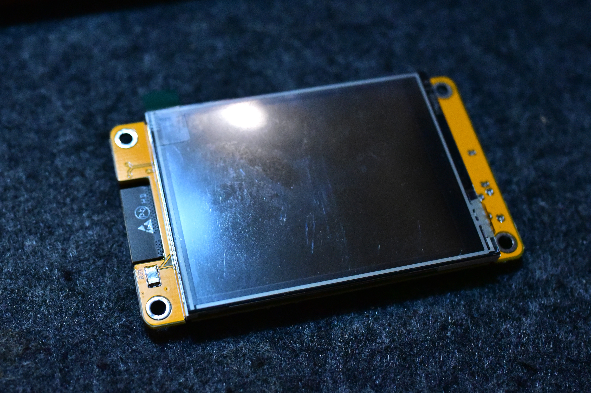
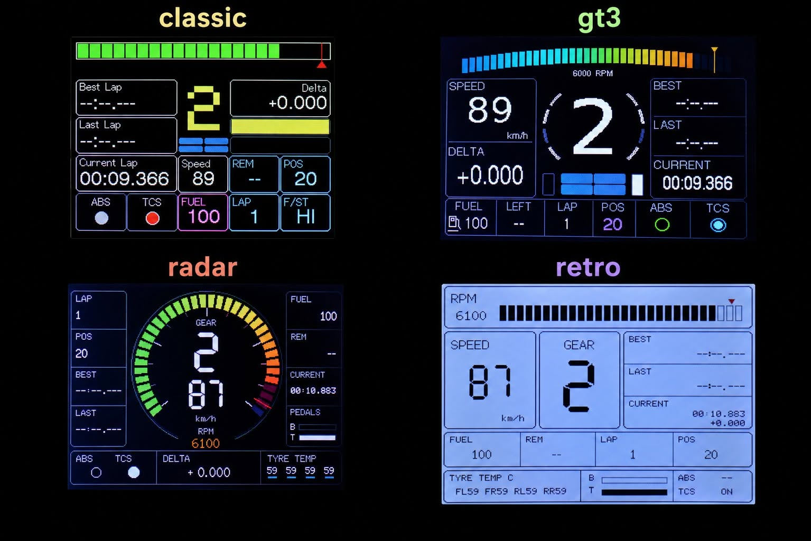
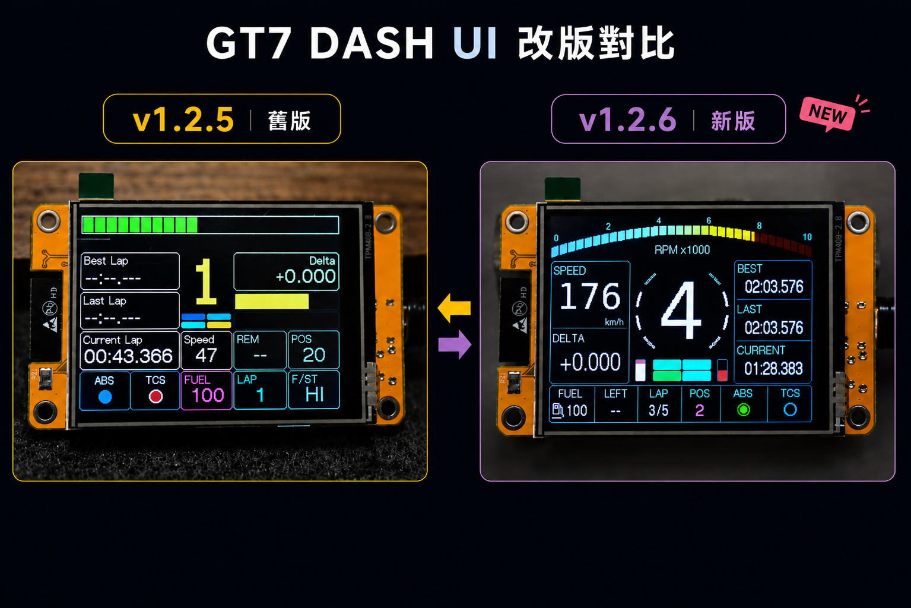

# ESP32 GT7 Dashboard ([線上安裝](https://caa1211.github.io/esp32-gt7-dashboard/))

[English](README.md) | [繁體中文](README.zh-TW.md)

> **主題開發：** 架構、開發流程與實機驗收項目請參考[主題開發指南](docs/THEME_DEVELOPMENT.md)及[實作規畫](docs/THEME_SWITCH_PLAN.md)。

一個專為 **Gran Turismo 7** 打造、完全運行於 **ESP32** 的獨立儀表板。

**不需要 SimHub • 不需要 PC • 自動搜尋 PS5**

<p align="center">
  
</p>

<p align="center">
  🎥 <a href="https://www.youtube.com/shorts/kHaoZkZnk8g"><strong>觀看儀表板示範影片</strong></a>
</p>

只需將 ESP32 與 PS5 連接到同一個 Wi-Fi 網路，即可直接接收 Gran Turismo 7 的即時遙測資料。

```
                ┌──────────────┐
                │     PS5      │
                │ Gran Turismo │
                │      7       │
                └──────┬───────┘
                       │ UDP
                Wi-Fi  │
                       ▼
              ┌─────────────────┐
              │ ESP32 Dashboard │
              │  Auto Detect    │
              └─────────────────┘
                       │
                2.8" TFT Display
```

---

## 功能特色

- 🚗 透過 Wi-Fi 直接接收 GT7 遙測資料
- 📡 自動搜尋並連線 PS5
- 🔍 不需要手動設定 PS5 IP 位址
- ⚡ 不需要 SimHub
- 💻 安裝完成後不需要電腦
- 📶 內建 Wi-Fi 設定頁面
- 🏁 目前圈速、上一圈、最佳圈
- ⏱ 即時 Delta（圈速差）
- ⛽ 油耗與剩餘油量預估
- 🔄 預估剩餘可行駛圈數
- 🚦 RPM 轉速條與換檔提示燈
- 🚨 ABS 指示燈
- 📊 即時賽車資訊顯示
- 🌙 手動熄屏
- 😴 自動休眠與自動喚醒
- 💾 自動儲存 Wi-Fi 設定
- 🎯 專為 Gran Turismo 7 設計

---

## 支援硬體

目前支援：

- ESP32-2432S028（2.8 吋 ILI9341 觸控螢幕）
- ESP32-2432S028（2.8 吋 ST7789 觸控螢幕）

<p align="left">
  
</p>

---

## 儀表主題

同一份韌體內建四種儀表主題，並提供相同的即時 GT7 遙測功能：

- **GT3**（預設）— 置中檔位、弧形換檔燈與深色賽車風格版面。
- **Classic** — 原本偏工程風格的五欄儀表板。
- **Retro** — 暖色紙張底、深色文字與低調提示色的復古儀表板。
- **Radar** — 以圓形轉速環為核心、兩側配置遙測資訊的深色儀表板。

<p align="center">
  
</p>

螢幕亮起時點一下，選擇 **SELECT THEME**，再選取需要的主題。主題會以固定 enum 值儲存並在重新開機後恢復；重設 Wi-Fi 不會清除主題或亮度設定。

<p align="center">
  
</p>

---

## 安裝方式

### Web Installer（推薦）

不需要安裝任何開發工具。

1. 使用 USB 將 ESP32 連接到電腦。
2. 開啟 Web Installer。
3. 選擇板子使用的顯示控制器：**ILI9341** 或 **ST7789**。
4. 點擊 **Install**。
5. 等待安裝完成。
6. 拔除 USB 並重新上電。

👉 **https://caa1211.github.io/esp32-gt7-dashboard/**

網頁安裝程式支援本專案所設定的傳統 ESP32 目標。韌體維護者可參閱
[docs/RELEASING.md](docs/RELEASING.md)，了解本機編譯、二進位檔案放置、燒錄位址及發佈流程。

---

## 快速開始

### 首次設定

第一次開機（或重設 Wi-Fi 後），裝置會自動進入 Wi-Fi 設定模式。

1. 使用手機或電腦連接下列 Wi-Fi：

```
GT7-DASH-SETUP
```

2. 設定頁面會自動開啟。

若沒有自動開啟，請手動瀏覽：

```
http://192.168.4.1
```

3. 選擇家中的 Wi-Fi。
4. 輸入 Wi-Fi 密碼。
5. 點擊 **Save**。
6. 裝置會自動重新啟動。
7. 開啟 **Gran Turismo 7**。

<p align="center">
  
</p>

之後儀表板會自動搜尋並連線到同一個區域網路中的 PS5，不需要設定 PS5 IP 位址。

---

## 操作方式

### 觸控螢幕

**點一下**

- 螢幕亮起時開啟設定選單。
- 螢幕休眠時只喚醒顯示，第一次點擊不會同時進入設定。
- 選擇並儲存 Classic、GT3、Retro 或 Radar 儀表主題。
- 進入 **DEVICE SETTINGS**，以 10% 級距調整 20%～100% 的亮度。
- 從 Device Settings 透過獨立確認畫面重設已儲存的 Wi-Fi。

亮度預設為 80%，調整後會儲存，重新開機或喚醒時會恢復；自動休眠仍會完全關閉背光。

沒有儲存過主題時會使用 GT3。Classic、GT3、Retro 與 Radar 顯示相同的支援遙測資料，只有呈現方式不同。

<p align="center">
  
</p>

---

## 自動休眠

為了降低耗電並延長螢幕壽命：

- 長時間未收到 GT7 遙測資料時，螢幕會自動進入休眠。
- 收到 GT7 遙測資料後，會自動恢復顯示。
- 自動休眠後可點擊螢幕恢復顯示。

---

## 開發計畫

- [x] GT7 即時遙測
- [x] 自動搜尋 PS5
- [x] Wi-Fi 設定頁面
- [x] 油耗預估
- [x] 剩餘圈數預估
- [x] 即時 Delta
- [x] ABS 指示燈
- [x] 自動休眠
- [x] 手動熄屏
- [ ] OTA 韌體更新
- [ ] 支援更多顯示器
- [ ] 自訂主題
- [ ] 多種儀表版面

---

## 從原始碼編譯

本專案使用：

- PlatformIO
- Arduino Framework
- ESP32

下載原始碼後，使用 PlatformIO 同時編譯兩種顯示控制器版本：

```bash
git clone https://github.com/caa1211/esp32-gt7-dashboard.git
cd esp32-gt7-dashboard
pio run -e esp32 -e esp32-st7789
```

產生的 application image 位於：

- `.pio/build/esp32/firmware.bin` — ILI9341
- `.pio/build/esp32-st7789/firmware.bin` — ST7789

若要建立正式發佈版本，同時同步版本號、複製兩份 image 到
`installer/firmware/`，並驗證兩份 installer manifest，請執行：

請先在 `installer/release-notes.json` 加入新版本的簡短差異說明。發布指令會將
兩種螢幕版本封存給 Installer 使用，並自動只保留最近五個版本。

```bash
npm run publish:firmware -- 1.2.5
```

請將 `1.2.5` 替換成這次要發佈的版本號。

---

## 貢獻

歡迎提出 Bug 回報、功能建議或 Pull Request。

如果你有新的功能想法，或希望支援其他 ESP32 顯示器，也歡迎提出 Issue。

---

## 開源專案致謝

本專案參考並使用了許多優秀的開源專案，沒有這些專案就無法完成本作品。

### SIMHUB ESP32 SUNTON Screen

https://github.com/1achy/https---github.com-1achy-SIMHUB-ESP32---SUNTON-screen

本專案最初由此專案 Fork 而來，之後已大幅改寫，發展為可直接接收 GT7 遙測資料、與 PS5 通訊，且完全不依賴 SimHub 的獨立儀表板。

### gt7-udp

https://github.com/MacManley/gt7-udp

提供 GT7 UDP 遙測封包解析的重要參考。

### WiFiManager

https://github.com/tzapu/WiFiManager

提供 Wi-Fi 設定頁面與 Captive Portal 功能。

### ESP32 CYD 3D 列印外殼

MakerWorld 上提供了一款專為 **ESP32-2432S028（2.8 吋 CYD）** 設計的輕薄外殼。

https://makerworld.com/zh/models/2171220-slim-minimal-case-for-esp32-cyd-2-4-2-8#profileId-2354976

感謝所有作者與貢獻者對開源社群的付出。

---

## 授權

本專案採用 **MIT License**。

---

## 支持專案

如果這個儀表板對你有幫助，歡迎支持專案持續開發：

☕ [**在 Ko-fi 支持我**](https://ko-fi.com/caa1211)
