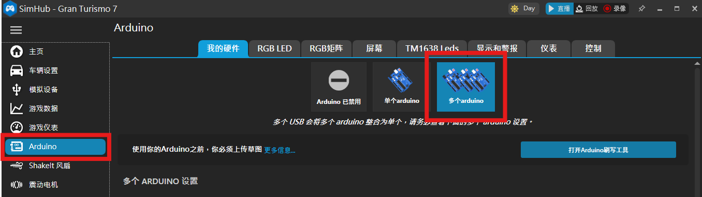
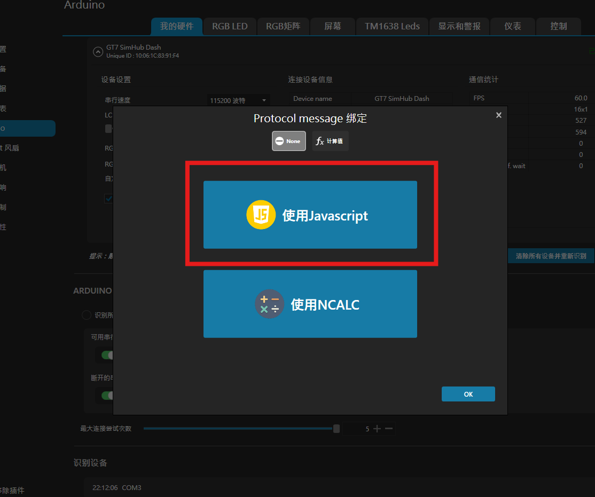
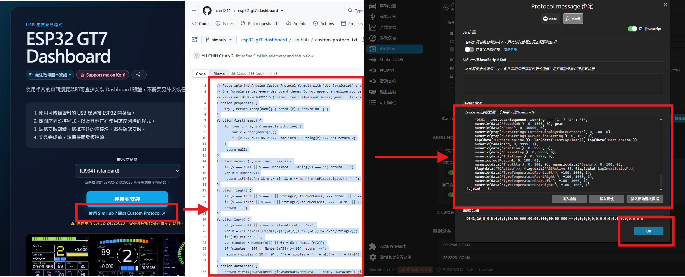

# SimHub USB 設定

本儀表支援透過 Wi-Fi 直連 **GT7**，也支援 PC 遊戲使用 **SimHub USB**。SimHub USB 不需要 Wi-Fi，而且所有儀表主題共用同一份 Custom Protocol。

## 1. 準備儀表

1. 使用可傳輸資料的 USB 線把儀表接到電腦。
2. 在儀表選擇 **SIMHUB USB**。若目前停在 Waiting 畫面，可點上方的 **SWITCH TO SIMHUB USB**；也可以進入 **Settings → Device Settings**，直接選擇 **SIMHUB USB**。
3. 關閉 Arduino Serial Monitor、PlatformIO Serial Monitor，以及其他可能占用相同 COM 埠的程式。

## 2. 讓 SimHub 偵測儀表

1. 開啟 SimHub，進入 **Arduino** 頁面。
2. 打開 **Multiple Arduino**／**Multiple USB** 裝置頁面。不同 SimHub 版本的名稱可能略有差異；即使只有一台儀表，也使用多裝置頁面。

*進入 Arduino 頁面並選擇多個 Arduino，讓 SimHub 開始掃描儀表。*

3. 啟用 Arduino 功能，讓 SimHub 掃描 USB 裝置。
4. 找到儀表所在的 COM 埠，並加入或啟用該裝置。韌體識別名稱為 `GT7 SimHub Dash`。
5. 等待 SimHub 顯示裝置已連線。看到 COM 埠只代表 USB 已偵測到；還要完成下一段 Custom Protocol (自訂義協議) 設定才會有遙測資料。

*確認 SimHub 已識別 `GT7 SimHub Dash`、啟用正確的 COM 埠，並顯示裝置已連線。*

初始連線速度為 19200 baud，之後由 SimHub 自動協商，不需要手動建立虛擬 COM、TCP 連線或安裝額外外掛。

## 3. 加入 Custom Protocol (自訂義協議)

1. 在剛加入的 Arduino 裝置中，找到 **Custom Protocol** 設定或公式編輯器。
2. 啟用 **Use JavaScript**。

*SimHub 詢問 Protocol message 綁定方式時，選擇 **Use JavaScript**。*

3. 開啟 [simhub/custom-protocol.txt](simhub/custom-protocol.txt)，複製檔案的**全部內容**並貼入公式欄位。

*開啟 Repo 中的 protocol 檔案、複製全部內容、貼入 JavaScript 欄位，最後按下 **OK**。*

4. 按下 Apply／Save，並確認 Custom Protocol 已啟用在正確的 COM 裝置上。

公式編輯器的 **Raw result** 應以 `DSH1;` 開頭，而且第二欄序號會持續增加，例如 `DSH1;391;...`。這表示公式正在執行，但仍需確認資料送往正確的 Arduino 裝置與 COM 埠。

這是 SimHub 的 **Arduino Custom Protocol**，不是 Custom Serial Devices 外掛。請勿使用 SimHub 的一般 Arduino sketch upload，否則會覆蓋本儀表韌體。

## 4. 開始遊戲

1. 在 SimHub 中啟動或選取支援的 PC 遊戲。
2. 確認 SimHub 已收到遊戲資料。
3. 儀表會從 **Waiting for SimHub** 切換至所選主題。

若 SimHub 已認出裝置，但儀表仍停在 Waiting：

- **USB linked: set Custom Protocol**：USB 與 SimHub 已連線，但尚未收到有效公式資料。確認已啟用 **Use JavaScript**、貼入完整公式並按下 Apply／Save。
- **Check Custom Protocol (DSH1)**：公式格式或版本不正確。重新貼入 [simhub/custom-protocol.txt](simhub/custom-protocol.txt)。
- 一直顯示 **Waiting for SimHub**：確認使用資料線、選對 COM 埠、沒有其他程式占用序列埠，而且 SimHub 正在收到遊戲資料。
- Raw result 以 `DSH1;` 開頭且序號持續增加，但仍停在 Waiting：確認 Custom Protocol 已啟用於 SimHub 顯示為已連線的同一個 Arduino 裝置與 COM 埠。
- 個別欄位顯示 `--`：該遊戲可能沒有提供對應屬性；其他支援欄位仍可正常使用。

## 注意事項

- 七個主題共用同一份公式，切換主題後不需要重新設定 SimHub。
- 儀表會保存目前的連線選擇。可直接在 Waiting 畫面切換，或在 **Device Settings** 選擇 **DIRECT GT7**／**SIMHUB USB**。
- **Reset to Default** 會清除 Wi-Fi 與所有儀表設定，然後重新開始首次設定流程。
- Repo 其他位置的歷史公式使用舊封包格式；本韌體只能使用 [simhub/custom-protocol.txt](simhub/custom-protocol.txt)。

## 參考資料

- [English guide](SIMHUB_README.md)
- [SimHub Custom Arduino Hardware Support](https://github.com/SHWotever/SimHub/wiki/Custom-Arduino-hardware-support)
- [SimHub JavaScript Formula Engine](https://github.com/SHWotever/SimHub/wiki/Javascript-Formula-Engine)
- [Telemetry protocol and validation](docs/TELEMETRY_PROTOCOL.md)
